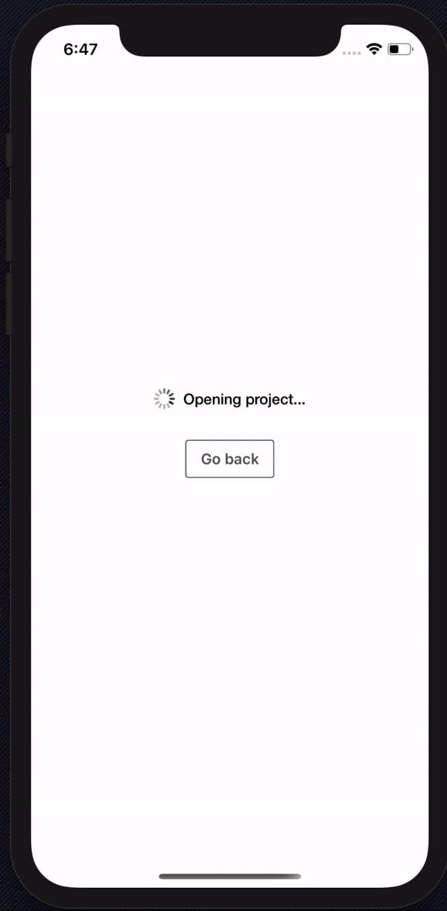
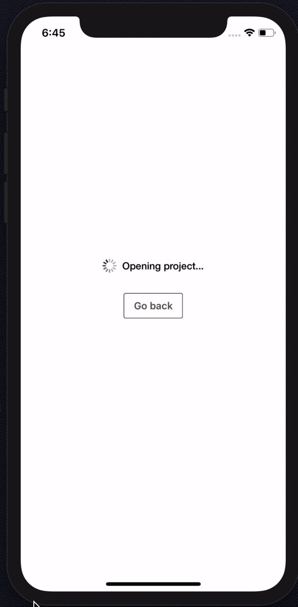

<h1 align="center">
🧱 React Native Masonry ScrollView
</h1>

<div align="center">

Simple easy to use Masonry ScrollView for React Native that extends the original ScrollView ✨

[![Version][version-badge]][package]
[![Downloads][downloads-badge]][npmtrends]

<!-- [![Build Status][build-badge]][build]
[![Code Coverage][coverage-badge]][coverage] -->

[![Star on GitHub][github-star-badge]][github-star]
[![Watch on GitHub][github-watch-badge]][github-watch]
[![Twitter Follow][twitter-badge]][twitter]

</div>

<p align="center" >
  <kbd>
    
  </kbd>
  <kbd>
    
  </kbd>
  <br>
  <em>From the Example App</em>
</p>

## Installation

```sh
yarn add react-native-masonry-scrollview

# or

npm i react-native-masonry-scrollview
```

## Usage

The Masonry ScrollView splits the content of the `ScrollView` into multiple columns or rows (depending on horizontal or vertical scroll) and renders the items into the individual column's `View` component. This component is built to extend the existing `ScrollView` component hence all the properties of the `ScrollView` will work with it and it can render any component supplied to it as children.

```jsx
import React from "react";
import { View, StyleSheet } from "react-native";
import RNMasonryScroll from "react-native-masonry-scrollview";

const Box = () => <View style={styles.box} />;

const App = () => (
  <RNMasonryScroll>
    {/**
     * Masonry ScrollView only expects children as a list
     */}
    {[
      <Box key={0} />,
      <Box key={1} />,
      <Box key={2} />,
      <Box key={3} />,
      <Box key={4} />,
      <Box key={5} />
    ]}
  </RNMasonryScroll>
);

const styles = StyleSheet.create({
  box: {
    height: 50,
    width: 50,
    backgroundColor: "red",
    margin: 16
  }
});

export default App;
```

## Advanced Usage

Refer the example expo app in `RNMasonryExample/` directory of this repo 👍

## Properties

### `children: ReactNode[]`

Children of the Masonry ScrollView component should always be an array of React Nodes.

---

### `columns?: number`

Number of columns to split the Masonry

---

### `columnStyle?: StyleProp<ViewStyle>`

Style applied to the `View` component that is wrapping your components inside the Masonry ScrollView.

---

### `oddColumnStyle?: StyleProp<ViewStyle>`

Style applied only to the n-th odd columns of the Masonry ScrollView. If you have 3 columns, this style will be applied to columns 1 & 3.

---

### `evenColumnStyle?: StyleProp<ViewStyle>`

Style applied only to the n-th even columns of the Masonry ScrollView. If you have 3 columns, this style will be applied to column 2.

---

### `horizontal?: boolean`

Control if the masonry is horizontal or vertical

---

### ScrollViewProps

All the existing ScrollView Props are supported by this component since it simply extends the actual ScrollView.

---

## Example App

The example app is built with expo, you can run the app following the official [expo docs](https://expo.io/learn).

## Licenses

MIT © [DaniAkash][twitter]

<!-- [build-badge]:
[build]:
[coverage-badge]:
[coverage]:  -->

[downloads-badge]: https://img.shields.io/npm/dm/react-native-masonry-scrollview.svg?style=flat-square
[npmtrends]: http://www.npmtrends.com/react-native-masonry-scrollview
[package]: https://www.npmjs.com/package/react-native-masonry-scrollview
[version-badge]: https://img.shields.io/npm/v/react-native-masonry-scrollview.svg?style=flat-square
[twitter]: https://twitter.com/dani_akash_
[twitter-badge]: https://img.shields.io/twitter/follow/dani_akash_?style=social
[github-watch-badge]: https://img.shields.io/github/watchers/DaniAkash/react-native-masonry-scrollview.svg?style=social
[github-watch]: https://github.com/DaniAkash/react-native-masonry-scrollview/watchers
[github-star-badge]: https://img.shields.io/github/stars/DaniAkash/react-native-masonry-scrollview.svg?style=social
[github-star]: https://github.com/DaniAkash/react-native-masonry-scrollview/stargazers
